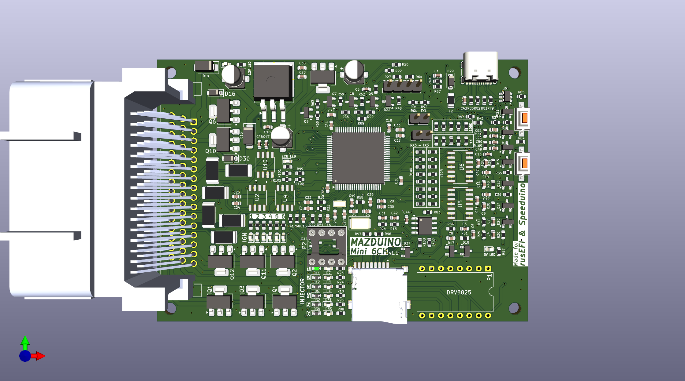
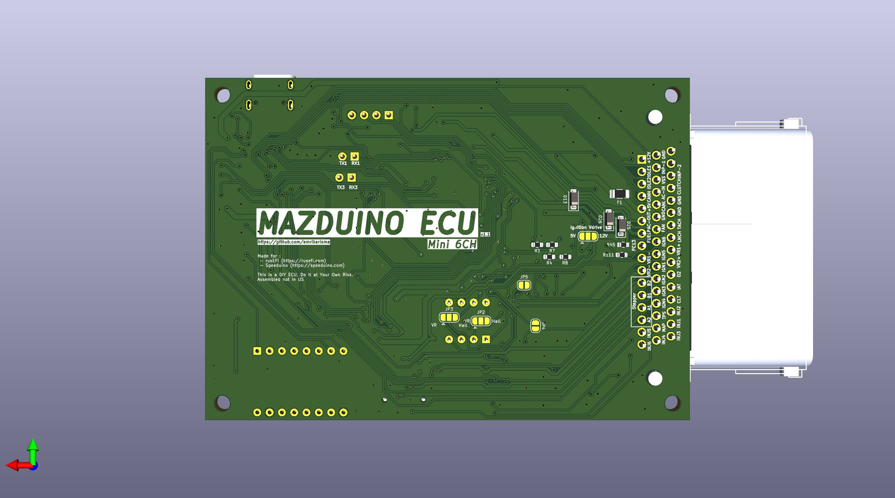

# Mazduino Mini 6Ch
## Preview
<table>
  <tr>
    <td></td>
    <td></td>
  </tr>
  <tr>
    <td></td>
    <td></td>
  </tr>
</table>

## Features
- Processor/MCU: STM32F407
- 6 Channel Coil outputs for Smart Coil (For dumb coil, please add external IGBT)
- 6 Channel Injector outputs
- 2 High Current Outputs (Idle/Boost/VVT)
- Tachometer Output
- Fuel Pump Low Current Output
- FAN Low Current Output
- AC Compressor Low Current Output
- CKP Trigger Input (Hall/Optical/VR)
- CMP Trigger Input (Hall/Optical/VR)
- Supports VR-Conditioner Module (DIP 8)
- Supports Stepper Module (DRV8825)
- External MAP Sensor Analog Input
- TPS Sensor Analog Input
- IAT Sensor Analog Input
- ECT/CLT Sensor Analog Input
- O2 Sensor Analog Input
- Spare Analog Input 1 (Can be used for Fuel Pressure Sensor or others)
- Spare Analog Input 2 (Can be used for Oil Pressure Sensor or others)
- AC Switch Digital Input/GND signal
- Launch Control Input
- Clutch Input
- VSS Input
- Supports Micro SD Card for data logging via SPI
- Supports CANbus communication with MCP2551 IC
- Automotive 48-pin Yamaha ECU Connector

## Downloads
- [Download Schematic (PDF)](Schematic.pdf)
- [Download BOM](BOM.pdf)
  
## Changelog
```
v1.0
- Initial Release

v1.1 (latest)
- Fix USB D+ and D-
- Add 2 Spare analog input
- Change AC Switch from Analog Input to Digital Pin ( GND signal )

v1.2 (coming soon)
- Replace footprint Capacitor for Input Regulator 5v from 5x5 to 8x6
- Add low current output for Main relay control
- Fix DRV8825 schema for rusEFI
```


Will be updated as soon as possible... please wait.
