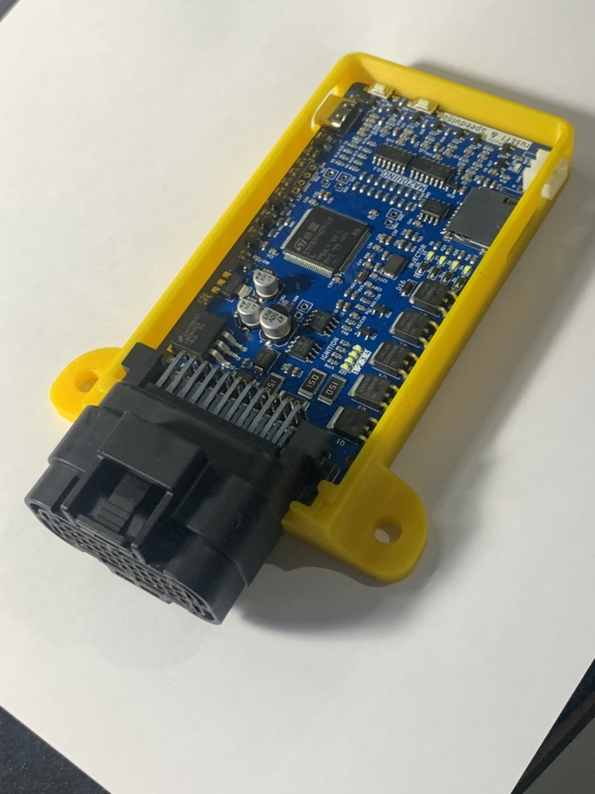
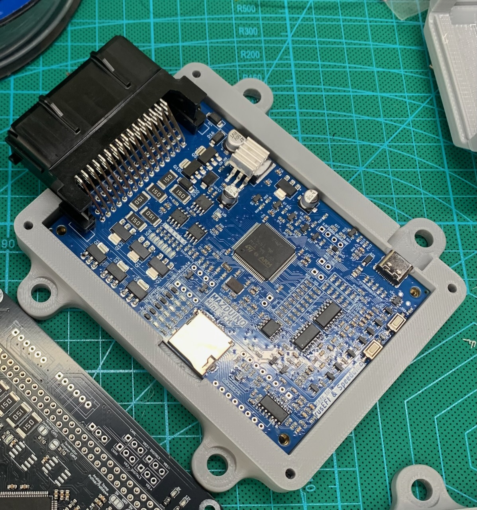
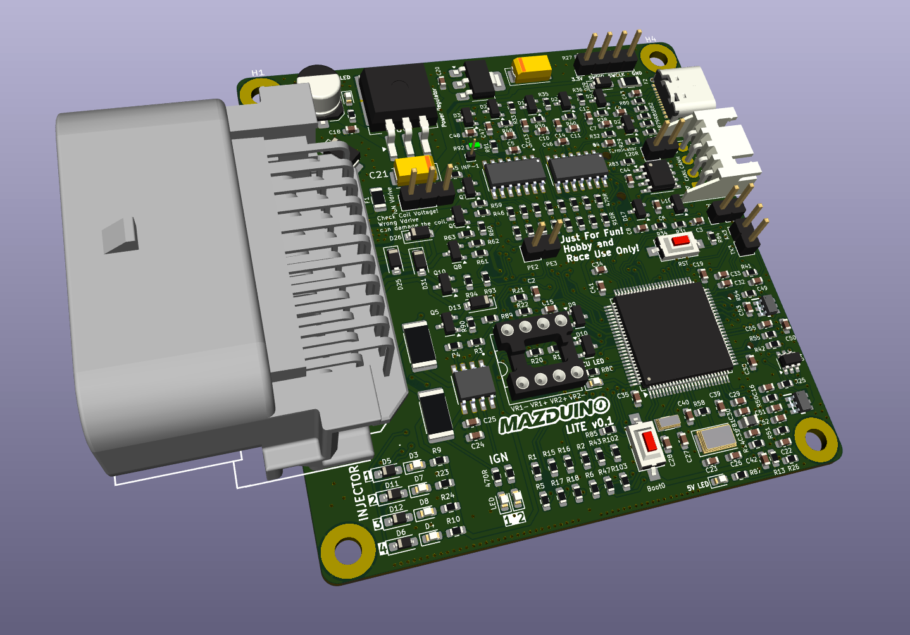
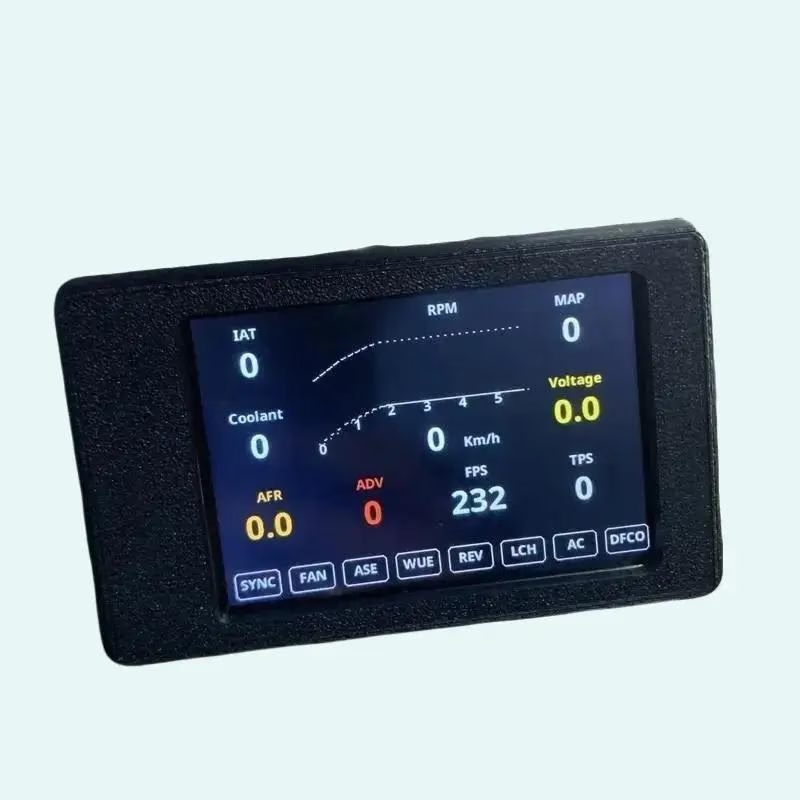

# Mazduino
*Mazduino ECU* is built on **STM32** MCU, compatible with **rusEFI**-based firmware — including official **rusEFI**, **epicEFI**, **FomeEFI**, and other rusEFI-based custom firmware. For tuning and configuration, you can use the Tuner Studio software.

## Mazduino ECU Compact

A compact and customizable Engine Control Unit (ECU) designed for **4-cylinder engines with full sequential injection and ignition**.

## Mazduino ECU Mini 6Ch

A mini 6-channel version of the Mazduino ECU for **6-cylinder engines with full sequential injection and ignition**.

## Mazduino ECU Lite Edition

A lightweight and compact ECU designed for **4-cylinder engines with full sequential injection and wasted spark ignition**.

## Mazduino Display

A dedicated dashboard ECU display module that shows real-time vehicle data retrieved from the main ECU.

## Mazduino WBO (Wideband Oxygen Sensor Controller)

A wideband oxygen sensor controller that communicates with the ECU via CAN bus for accurate air-fuel ratio monitoring. Supports LSU 4.2, LSU 4.9, and LSU 4.9 Adv sensors with easy manual assembly design.

*Documentation for all variants will be updated as soon as possible.*

## Links
### Mazduino
- **Official Website**: https://www.mazduino.com
- **Documentation & WIKI**: https://wiki.mazduino.com

### Firmware & Software
- **rusEFI**: https://rusefi.com/
- **Tuner Studio**: https://www.tunerstudio.com/index.php/tuner-studio
